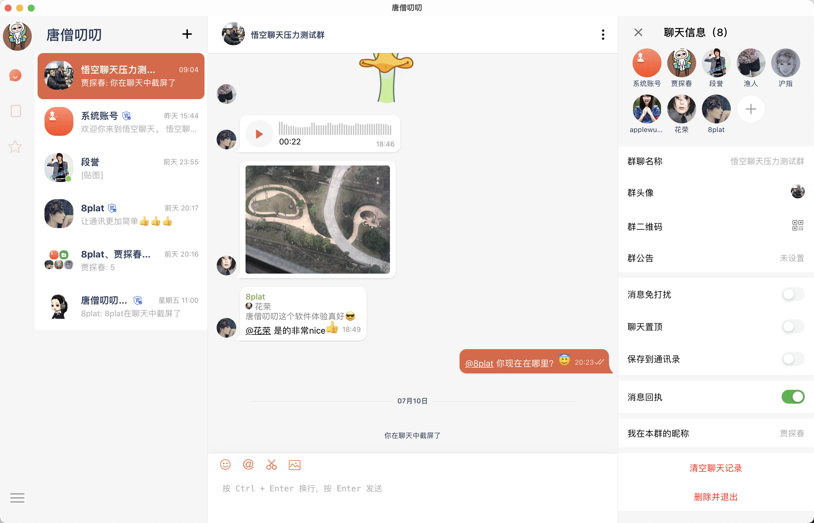
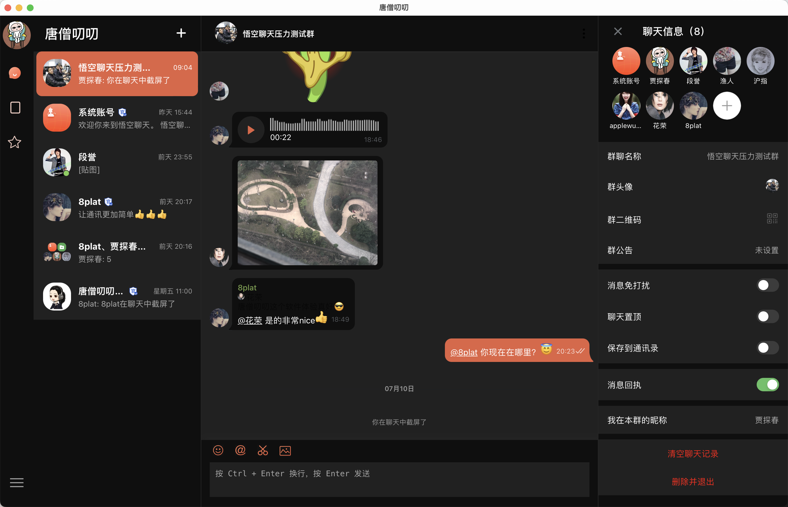

## 唐僧叨叨

开源社区第二屌(🦅)的即时通讯软件

    一款非微信专家，非腾讯专家，历时<a href="#">八年</a>时间打造的<a href="#">运营级别</a>的开源即时通讯聊天软件(<a href='https://github.com/WuKongIM/WuKongIM'>悟空IM</a>提供通讯动力)

<!--  -->

 

愿景
------------

让企业轻松拥有自己的即时通讯软件。

演示截图
------------

|对方正在输入|语音消息|合并转发|
|:---:|:---:|:--:|
||||

|快速回复|群内操作|        其他功能         |
|:---:|:---:|:-------------------:|
|||  |

功能特性
------------
- [x] 全局特性
    - [x] 消息永久存储
    - [x] 消息加密传输
    - [x] 消息多端同步(app,web,pc等)
    - [x] 群聊人数无限制
- [x] 消息列表
    - [x] 单聊
    - [x] 群聊
    - [x] 列表提醒项，比如消息@提醒，待办提醒，服务器可控
    - [x] 置顶
    - [x] 消息免打扰
    - [x] web登录状态显示
    - [x] 消息搜索
    - [x] 消息输入中
    - [x] 消息未读数
    - [x] 用户标识
    - [x] 无网提示
    - [x] 草稿提醒
- [x] 消息详情
    - [x] 文本消息
    - [x] 图片消息
    - [x] 语音消息
    - [x] Gif消息
    - [x] 合并转发消息
    - [x] 正在输入消息
    - [x] 撤回消息
    - [x] 群系统消息
    - [x] 群@消息
    - [x] 消息回复
    - [x] 消息转发
    - [x] 消息收藏
    - [x] 消息删除
- [x] 通讯录
    - [x] 新的朋友
    - [x] 保存的群
    - [x] 联系人列表
- [x] 我的
    - [x] 个人信息
    - [x] 新消息通知设置
    - [x] 安全与隐私
    - [x] 通用设置
    - [x] 聊天背景
    - [x] 多语言
    - [x] 黑暗模式
    - [x] 设备管理

没有满足的特性？看看企业版。

演示地址
------------

| Android扫描体验 | iOS扫描体验(商店版本 apple store 搜“唐僧叨叨”) |
|:---:|:---:|
|||

MAC版: [点击下载](docs/download/android.png)

Windows版: [点击下载](docs/download/android.png)

Ubuntun版: [点击下载](docs/download/android.png)

Web端: [点击体验](https://web.botgate.cn)

